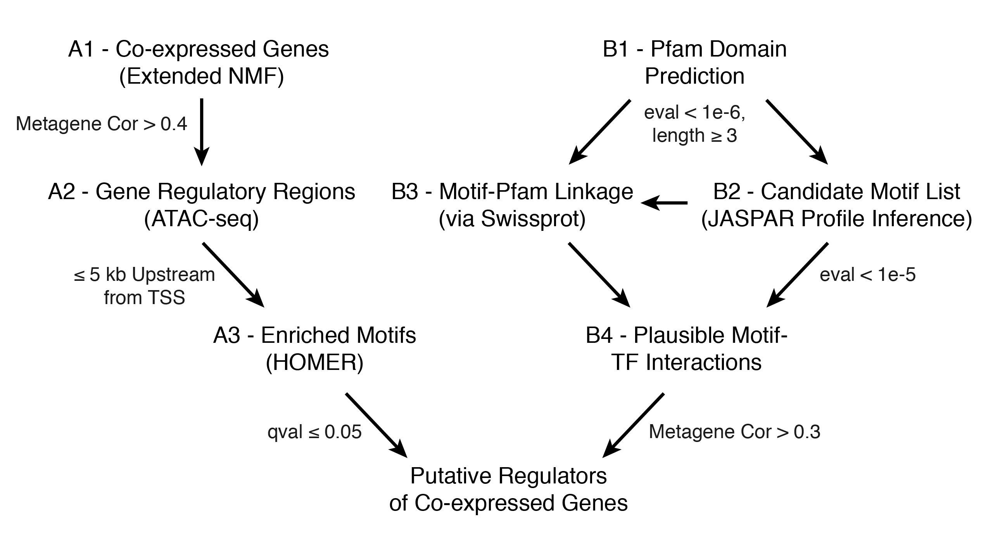

The code below is designed to identify transcription factors (TFs) that are likely to play a functional role in coordinating transcriptional cell states in *Hydra*. To do this, we test for motif enrichment in the regulatory sequences of coexpressed genes. We then identify TFs that (1) belong to the set of coexpressed genes and (2) can bind to one of the enriched motifs. TFs that meet these criteria are considered likely to play an important role in regulating that gene coexpression module.

To perform this analysis we need to know (1) which genes are coexpressed, (2) where putative regulatory sequences are in the genome, (3) which transcripts are likely to be TFs, and (4) what motifs those putative TFs are likely to bind. Information on (1) will be determined using non-negative factorization to identify coexpressed genes (metagenes or gene modules). (2) will be drawn from a consensus peakset derived from whole-animal ATAC-seq data. (3) and (4) will use a combination of Pfam annotations and the profile inference tool from the JASPAR RESTful API.



  Figure 1 is a visual summary of the analysis. Headers throughout this markdown will refer back to the corresponding steps in the workflow to orient the reader. For a more detailed written explanation of this figure, refer to supplemental figure S34.

```{r setup, include=FALSE}
knitr::opts_chunk$set(tidy.opts=list(width.cutoff=60),tidy=TRUE,dev="png",dpi=150)
knitr::opts_chunk$set(echo = T, message = F, warning = F, fig.align = 'center', eval = FALSE)

library(Seurat)
library(magick)
library(knitr)
library(xtable)
library(ggplot2)
library(kableExtra)
library(jsonlite)
library(Biostrings)
library(httr)
library(plyr)
library(dplyr)
library(gplots)
library(RColorBrewer)
library(doParallel)

```

### Preparation for Analysis

In this chunk we establish our write path for file export and load several functions that we will need.

```{r Load Pre-existing Objects, cache.lazy=FALSE}

ds.ds <- readRDS("objects/Hydra_Seurat_Whole_Genome.rds")

annotations <- ds.ds@data@Dimnames[[1]]
annotations <- data.frame(do.call('rbind', strsplit(annotations,"[|]")), stringsAsFactors = F)
annotations[annotations[,1] == annotations[,2],2] <- NA
colnames(annotations) <- c("ID","SP")

writePath <- "./Enrichment_Results"
dir.create(writePath)
Sys.setenv(WRITEPATH = writePath)

hFind <-function (y,x) { 
  return (y@data@Dimnames[[1]][grep(x,y@data@Dimnames[[1]],ignore.case = T)])
  }

printGenetSNE <- function (y,x,w) {
  pdf(paste0(w, "/", x, ".pdf",sep = ""), width=10, height=10)
  FeaturePlot(y, x, cols.use=c("grey", "blue"), pt.size = 2)
  dev.off() 
}

#if you you would like to restore an environment from a previous session, execute the code below
#load("./Enrichment_Results/enrichment_workspace.RData")
```


# Identifying and Exporting Metagene-Associated Peaks (A1 & A2)

## Subsetting the Consensus Peakset

First we need to isolate those genomic regions that are likely to regulate the transcription of a set of coexpressed genes (as determined by metagene association, see below). We will be using ATAC-seq peaks generated from three biological replicates of whole *Hydra*. These peaks pass an IDR threshold of 0.1 in at least one pairwise comparison between the three biological replicates (76476 total peaks). 

To link peaks to genes, we used the [UROPA package](https://github.molgen.mpg.de/loosolab/UROPA) which uses a simple set of rules to perform peak annotation based on proximity to gene models. The output table used below was generated using the following settings: 

"distance": ["100000"], "direction": ["any_direction"], "feature.anchor": ["start", "end"], "internals": ["any"], "feature": ["gene"], "attribute.value": ["None"], "priority": ["False"],"show.attributes": ["ID"],"filter.attribute": ["None"], "strand": ["ignore"]

For this analysis we will limit the distance to within 5kb upstream of the gene model's start codon. This parameter can be easily changed to have greater or fewer peaks if desired.

```{r Pull Peaks, results='asis'}

#import the peak annotations from uropa
peaks <- read.table("enrichment_resources/Whole_2Rep_IDR_finalhits.txt", header = T, stringsAsFactors = F)

#import the bed file that we will ultimately be subsetting
bedpeaks <- read.table("enrichment_resources/2Rep.IDR.mod.bed", stringsAsFactors = F)

#focus on peaks that either overlap the TSS, or that are upstream of it (within 5kB)
peaks <- peaks[peaks$genomic_location %in% c("overlapStart", "upstream"),]
peaks <- peaks[peaks$distance <= 5000,]

```

## Identifying Coexpressed Genes Using NMF Metagenes (A1)

To identify gene coexpression modules, we will pull metagene information from the NMF analysis conducted on the genome-mapped, whole animal dataset (wg_K84). The initial NMF was calculated on a set of ~1800 variable genes. Because we want to extend our analysis to genes not included in the initial variable gene list, we will determine additional metagene member genes based on how well they correlate with the NMF cell scores. Instead of considering the correlation across all cells, we limit the calculation to those cells that recieve a non-zero score for the metagene in question. This reduces the amount of computation required and is more favorable to genes that may also be expressed elsewhere (allows for non-exclusivity). We also exclude lowly expressed genes (must be expressed in at least 20 cells and have a mean expression (excluding zeros) above 0.5). For downstream analyses we consider a gene to be a member of a metagene if it's correlation score is > 0.4.

```{r Find Metagene Genes, results='asis'}

#pull cell scores from current NMF analysis (whole animal)
cellScores <- read.csv("nmf/wg_K84/GoodMeta_CellScores.csv", row.names = 1)

colnames(cellScores) <- gsub("X","",colnames(cellScores))
colnames(cellScores) <- gsub("[.]","-",colnames(cellScores))

cellScores <- t(cellScores)

#remove scores of zero from cell scores so those cells are excluded from correlation analysis
cellScores[cellScores == 0] <- NA

#isolate expression data from seurat object (normalized, log-space)
expressData <- as.matrix(ds.ds@data)

#unload full DS dataset (reduces memory footprint)
rm(ds.ds)

#exclude lowly expressed genes
expressData <- expressData[which(rowSums(expressData) > 0),]
expressData.mean <- apply(expressData,1,function(x) mean(x[x!=0]))
expressData.count <- apply(expressData,1,function(x) length(x[x>0]))
expressData <- expressData[which(expressData.mean > 0.5 & expressData.count > 20),]

#lineup rows for NMF and DS data to allow for correlation analysis
cellScores <- cellScores[match(rownames(cellScores),colnames(expressData)),]

#function to pull cell scores for a particular metagene and check it's correlation with every gene passing expression thesholds in the DS dataset
metaCor <- function(x) {
  cellScores.use <- cellScores[,x]
  apply(expressData,1, function(x) cor(x,cellScores.use, use = "pairwise.complete.obs"))
}

#Set up a parallel backend to perform a for loop that moves through all metagenes to check gene correlation
cl <- makeCluster(5)
registerDoParallel(cl)

start_time <- Sys.time()
corResults <- foreach(i=1:length(colnames(cellScores)), .verbose = T) %dopar% metaCor(i)
end_time <- Sys.time()

print(end_time - start_time)

corResults.df <- as.data.frame(corResults)
colnames(corResults.df) <- colnames(cellScores)

#save the results for later, so you don't need to run this part of the analysis multiple times
save(corResults.df, file = paste0(writePath,"/","corResults.Rdata"))

```

```{r, results='asis'}

#convert NAs to 0
corResults.df[is.na(corResults.df)] <- 0

#Exclude all results with a correlation below threshold. The remaining entries are the member genes for each metagene
corResults.keep <- apply(corResults.df,2,function(x) x[x > 0.4])

```

## Export Metagene-Associated Peaks (A2)

For our enrichment analysis, we will need a bed file containing the peaks associated with coexpressed genes for each metagene. This will be done based on the UROPA annotations described above. We will also output the list of genes that are considered members of each metagene as a text file of IDs.

```{r Export Metagene Peaks}
#get rid of peaks for genes not considered in the analysis
peaks <- peaks[peaks$ID %in% gsub("[.]t.*","", rownames(corResults.df)),]

#pull just the gene names
metaMark.genes <- lapply(corResults.keep, function(x) names(x))

#return all peaks associated with the markers for each metagene cell population
metaPeaks <- lapply(metaMark.genes, function(x) peaks[peaks$ID %in% gsub("[.]t.*","",x),])

metaPeaks <- lapply(metaPeaks, function(x) bedpeaks[bedpeaks$V4 %in% x$peak_id,])


#print bed files
invisible(lapply(1:length(metaPeaks), function(x) write.table(metaPeaks[[x]],file = paste0(writePath,"/",names(metaPeaks)[x],"_peaks.bed"), sep = "\t", row.names = F, col.names = F, quote = F)))

#also print gene lists
invisible(lapply(1:length(metaMark.genes), function(x) write.table(metaMark.genes[[x]], file = paste0(writePath,"/",names(metaMark.genes)[x],"_genes.txt"), sep = "\t", quote = F, row.names = F, col.names = F)))

# the code below will get the list of all peaks NOT associated with a particular metagene (one option for a control in the enrichment analysis; uncomment if control peaks are desired)

# controlIDs <- lapply(metaPeaks, function(x) peaks[!(peaks$peak_id %in% x$V4),])
# controlPeaks <- lapply(controlIDs, function(x) bedpeaks[bedpeaks$V4 %in% x$peak_id,])
# 
# #print control bed files
# invisible(lapply(1:length(controlPeaks), function(x) write.table(controlPeaks[[x]],file = paste0(writePath,"/",names(controlPeaks)[x],"_Controlpeaks.bed"), sep = "\t", row.names = F, col.names = F, quote = F)))


```

If you want to verify the co-expression of the predicted metagene gene sets, execute the code below to generate tSNE plots for all metagene genes.

```{r Generate Metagene Gene Plots}
#reload Seurat object
ds.ds <- readRDS("objects/Hydra_Seurat_Whole_Genome.rds")

#get a list of all files files in the output directory

fileList <- list.files(writePath)

#subset to include only the gene list files
fileList <- fileList[grepl("genes.txt",fileList)]


#go through each gene list and make plots
for (i in 1:length(fileList)) {
  
  plotDir <- paste0(writePath,"/","plots_", gsub(".txt","",fileList[i]))
  
  dir.create(plotDir, showWarnings = T)
  
  geneTable <- read.table(paste0(writePath,"/",fileList[i]), stringsAsFactors = F)
  
  for (y in 1:length(geneTable[,1])) {
    
    printGenetSNE(ds.ds,hFind(ds.ds, gsub("[|].*","",geneTable[y,1])),plotDir)
    
  }
}
```

# Identifying Putative Transcription Factors (B1)

## Select Gene Models with Predicted DNA Binding Domains (B1)

In order to identify those transcripts that could plausibly regulate transcription, we will pull all genes that recieved a Pfam annotaion for a DNA binding domain, which will serve as our initial list of putative TFs. As a starting point we will use the list of DNA binding domains from [Mendoza et al., 2013](http://www.pnas.org/content/110/50/E4858). We supplemented this list with POU, PAX, and COE domains.

```{r ID TFs with pfam, results='asis'}
#Load List of TF domains from Mendoza et al., 2013
pfam.TFdomains <- read.table("enrichment_resources/TF_domains.txt", stringsAsFactors = F)

#add POU, COE, and PAX domains
pfam.TFdomains <- c(pfam.TFdomains[,1], "PF00157", "PF00292", "PF16422", "PF16423")

#load genome pfam annotations
pfam.hits <- read.csv("enrichment_resources/hydra.augustus.pfam.filtered.csv", stringsAsFactors = F, row.names = 1)

#remove extra columns
pfam.hits <- pfam.hits[,1:4]

#eliminate stuff after decimal for transcriptome IDS
pfam.hits$V2 <- gsub("[.].*","",pfam.hits$V2)

#find transcripts with TF pfam hit
pfam.hits.TFs <- pfam.hits[pfam.hits$V2 %in% pfam.TFdomains,]

#get rid of duplicate hits
pfam.hits.TFs <- pfam.hits.TFs[!duplicated(pfam.hits.TFs$V4),]

pfam.hits.TFs <- pfam.hits.TFs[c(1,4)]

```

## Identify Transcription Factors Correlated with Gene Coexpression Modules

At this stage we can start identifying putative regulators of co-expressed genes based on TF correlation alone. While these candidates may or may not be supported by motif enrichment, they may still be of interest. Run this chunk of code to generate plots for all TFs that have a correlation score above 0.3 for each metagene (we opted to slightly lower the correlation cutoff to catch more marginal TFs that might still be of interest).

```{r ID Metagene TFs}

#add columns for TF rank for each metagene
corResults.df$ID <- gsub("[|].*","",rownames(corResults.df))

pfam.hits.TFs.scored <- corResults.df[gsub("[.].*","",corResults.df$ID) %in% pfam.hits.TFs$V4,]

#get list of top TFs for each metagene
topTfs <- apply(pfam.hits.TFs.scored[,1:(ncol(pfam.hits.TFs.scored) -1)], 2, function(x) {
  df <- data.frame(name = pfam.hits.TFs.scored$ID, score = x)
  df <- df[df$score > 0.3,]
  df
})

#eliminate empty DFs from list
topTfs[sapply(topTfs, function(x) nrow(x) == 0)] <- NULL

#mod ploting function for this particular application
printGenetSNE <- function (y,x,z) {
  pdf(paste0(z, "/",x, ".pdf",sep = ""), width=10, height=10)
  FeaturePlot(y, hFind(ds.ds,gsub("__.*","",x)), cols.use=c("grey", "blue"), pt.size = 2)
  dev.off() 
}

#reload seurat object
ds.ds <- readRDS("objects/Hydra_Seurat_Whole_Genome.rds")

#plot top TFs for each metagene
for (i in 1:length(topTfs)) {
  
  plotDir <- paste0(writePath,"/","topTF_plots_", names(topTfs[i]))
  
  dir.create(plotDir, showWarnings = T)
  
  geneTable <- topTfs[[i]]
  
  for (y in 1:length(geneTable[,1])) {
    
    printGenetSNE(ds.ds,geneTable[y,1],plotDir)
    
  }
}

#export text files with gene IDs for top TFs for each metagene
invisible(lapply(1:length(topTfs), function(x) write.table(topTfs[[x]][,1], file = paste0(writePath,"/",names(topTfs)[x], "_TF_IDs.txt"), quote = F, sep = "\t", row.names = F, col.names = F)))

```

# Identifying Potential Binding Motifs for *Hydra* TFs (B2 & B3)

In order to link regulatory sequence to potential regulators, we need to know the sequences bound by *Hydra* TFs. There are no *Hydra* TF binding data, so we need to rely on homology to assign binding motifs. JASPAR provides a means of doing this (through the RESTful API; **requires internet connection**) by identifying DNA binding regions in provided amino acid sequences and matching them to homologous domains for which the binding preference has been determined. It returns the motifs for the homologous domains. We can then search for these sequences in promoters to test for enrichment. If we do observe enrichment for a particular motif we can then link it to the TFs that were predicted to bind that motif.

## Identify Binding Motifs Using JASPAR Profile Inference (B2)

```{r Get JASPAR Motifs, eval = FALSE}

#import dovetail v.1 protein sequences
dovetailProteins <- readAAStringSet("enrichment_resources/hydra.augustus.nameMod.fastp", format = "fasta")

#limit to proteins with predicted DNA binding domains
useThese <- which(names(dovetailProteins) %in% gsub("[.]t.*","",pfam.hits.TFs$V4))

dovetailProteins <- dovetailProteins[useThese]

#remove isoforms
keepThese <- which(!duplicated(names(dovetailProteins)))

dovetailProteins <- dovetailProteins[keepThese]

#very very long protein sequences can cause the API to fail, so they must be excluded
notTooLong <- which(width(dovetailProteins) < 10000)

dovetailProteins <- dovetailProteins[notTooLong]

#remove genes that don't appear in dropseq
inDS <- which(names(dovetailProteins) %in% gsub("[.]t.*","",ds.ds@data@Dimnames[[1]]))

dovetailProteins <- dovetailProteins[inDS]

#initialize empty results list
results <- vector("list",length(dovetailProteins))

#pull putative binding motifs using jaspar RESTful API and put results into list
for (i in 1:length(dovetailProteins)) {
  print(i)
  link <- paste0("http://jaspar.genereg.net/api/v1/infer/",as.character(dovetailProteins[i]),"/")
  result <- fromJSON(url(link))
  result <- result[["results"]]
  if(length(result != 0)) {
    results[[i]] <- result
  } else {
    print("Empty")
  }
}

#pull names for each result
names(results) <- names(dovetailProteins)

results.hits <- results

#remove empty entries
results.hits[sapply(results.hits, is.null)] <- NULL

#remove hits above evalue threshold
results.hits <- lapply(results.hits, function (x) x[x$evalue < 1e-5,])

#remove genes with no hits above evalue threshold
results.hits[sapply(results.hits, function(x) length(x$evalue) == 0)] <- NULL

#make gene lookup table
genes.motifs.df <- data.frame(ID = as.character(names(results.hits)), 
                              motifs = vapply(results.hits, function(x) paste(x$matrix_id,collapse = ","),""))

#save the motif hits so we don't need to run this more than once
save(genes.motifs.df, file = paste0(writePath,"/","genes.motifs.Rdata"))
```

## Generate HOMER Motif Database Using JASPAR Profile Inference Tool

Once we have the motifs for each TF, we can generate the full list of motifs that we provide to HOMER. Then we will pull those motifs from the non-redundant CORE jaspar database (downloaded [**here**](http://jaspar.genereg.net/download/CORE/JASPAR2018_CORE_vertebrates_redundant_pfms_jaspar.zip)) and put them in a folder to be converted into HOMER motif files.


```{r Set Up Motif Files for Conversion}

#pull all (redundant) motif IDs from the motif lookup table 
genes.motifs <- paste0(genes.motifs.df$motifs, collapse = ",")

genes.motifs <- strsplit(genes.motifs, ",")

genes.motifs <- genes.motifs[[1]]

#drop duplicated motifs
motif.IDs <- unique(genes.motifs)

#collapse and format in a way that can be used with grep
motif.IDs <- paste0(motif.IDs, collapse = "|")

rm(genes.motifs)

#copy the JASPAR motif files we need into the Hydra_PFMs folder
fileList <- list.files("./JASPAR2018_CORE_redundant_pfms_jaspar", full.names = T)

#find files with match to hydra hit
fileList <- fileList[grep(motif.IDs, fileList)]

#clear out previous results if they exist
unlink("./Hydra_PFMs", recursive = T)

dir.create("Hydra_PFMs")

#copy motifs into new folder
invisible(lapply(fileList, function(x) file.copy(from = x, to = "./Hydra_PFMs/")))
```


We can then take these JASPAR motif files and convert them to HOMER motif files using a combination of BASH and R. HOMER comes with a function to reformat JASPAR motifs (parseJasparMatrix.pl), but this does not add a detection threshold -- instead just setting it to zero for all entries. The detection threshold determines the degree of degeneracy that is allowed for a sequence to be considered a TF binding site. Because motifs will differ in length and degree of sequence preference, these scores need to be tailored to each motif. The rscript PWM_convert.R (which is called as part of the shell script jaspar2homer.sh) will normalize JASPAR motifs such that each row sums to 1 and will report the threshold for that motif (set to be some percentage below the maximum possible score). The shell script then combines the modified header and matrix into a new HOMER motif file.

Note: See how a binding score is calculated [**here**](http://homer.ucsd.edu/homer/motif/creatingCustomMotifs.html). 

```{bash Convert Motifs, eval=FALSE}

cd enrichment_resources/Hydra_PFMs

../jaspar2homer.sh *.jaspar 2> /dev/null

cat *.motif > Hydra.motifs

rm *.final.motif

```

## Link JASPAR Motif to Pfam IDs Using Swissprot (B3)

There are many instances in which TFs do not recieve a match through the JASPAR profile inference tool; however, in many cases these TFs will have an annotation for a DNA binding domain that has a highly conserved core binding motif (such as bZIPs or bHLHs). By identifying the Pfam domains associated with particular motifs (via JASPAR and Swissprot), we can infer matches to enriched motifs based on domain composition of putative TFs.

The annotations for each JASPAR motif includes the swissprot entry for the TF in question. The swissprot entry in turn has the Pfam domains associated with that TF. Swissprot and JASPAR entries are accessible via APIs, so we can move through a list of motifs and then identify their associated Pfam domains via swissprot/JASPAR.

```{r Find motif domains}
#get list of JASPAR domains that we used for enrichment analysis
genes.motifs <- paste0(genes.motifs.df$motifs, collapse = ",")

genes.motifs <- strsplit(genes.motifs, ",")

genes.motifs <- genes.motifs[[1]]

motif.IDs <- unique(genes.motifs)

#initialize empty results list
results <- vector("list",length(motif.IDs))

#get uniprot IDs for each motif
for (i in 1:length(motif.IDs)) {
  print(i)
  link <- paste0("http://jaspar.genereg.net/api/v1/matrix/",as.character(motif.IDs[i]),"/")
  result <- fromJSON(url(link))
  result <- result[["uniprot_ids"]]
  if(length(result != 0)) {
    results[[i]] <- result
  } else {
    print("Empty")
  }
}

#pull names for each result
names(results) <- motif.IDs

results <- unlist(results)

SPresults <- vector("list",length(results))

#Pull the pfam domains assocaited with each swissprot entry
for (i in 1:length(results)) {
  print(i)
  link <- paste0("https://www.uniprot.org/uniprot/",results[i],".txt")
  result <- GET(link)
  result <- rawToChar(result$content)
  result <- strsplit(result, "\n")
  result <- result[[1]]
  result <- result[grepl("Pfam", result)]
  if(length(result != 0)) {
    result <- strsplit(result, ";")
    result <- lapply(result, function(x) x[2])
    result <- lapply(result, function(x) substring(x, 2))
    result <- unlist(result)
    SPresults[[i]] <- result
  } else {
    print("Empty")
  }
}

names(SPresults) <- results

#get rid of any pfam domains that aren't on our dna binding domain list
SPresults <- lapply(SPresults, function(x) x[x %in% pfam.TFdomains])

#get rid of empty results
SPresults[sapply(SPresults, function(x) length(x) == 0)] <- NA

SPresults <- lapply(SPresults, function(x) paste0(x, collapse = ","))

SPresults <- unlist(SPresults)

#generate table linking motif to pfam domain

pfam.lookup <- data.frame(JASPAR = names(results), Swissprot = results, PFAM = SPresults)
pfam.lookup <- pfam.lookup[pfam.lookup$PFAM != "NA",]
pfam.lookup <- apply(pfam.lookup, 2, function(x) as.character(x))
pfam.lookup <- as.data.frame(pfam.lookup, stringsAsFactors=FALSE)


#for pax genes, the swissprot entries give annotation for both homeobox and pax pfam annotations
#this is redundant because the pax domain includes at least a partial homeodomain, so these entries
#can be collapsed into just the pax domain
pfam.lookup$PFAM[pfam.lookup$PFAM == "PF00046,PF00292"] <- "PF00292"

#a similar case exists for pou domains
pfam.lookup$PFAM[pfam.lookup$PFAM == "PF00046,PF00157"] <- "PF00157"

s <- strsplit(pfam.lookup$PFAM, split = ",")

#compile results into table
pfam.lookup <- data.frame(JASPAR = rep(pfam.lookup$JASPAR, sapply(s, length)), Swissprot = rep(pfam.lookup$Swissprot, sapply(s, length)), PFAM = unlist(s))

pfam.lookup$PFAM <- as.factor(pfam.lookup$PFAM)

#collapse table such that there is only one row per pfam domain
pfam.lookup <- pfam.lookup %>% group_by(PFAM) %>% summarise(motifs = paste(JASPAR, collapse=","))

pfam.lookup <- as.data.frame(pfam.lookup, stringsAsFactors = FALSE)

#for each pfam domain listed, we want to list all hydra proteins that were annotated with that domain
hydra_pfam_match <- lapply(pfam.lookup$PFAM, function(x) gsub("[.]t.*","",pfam.hits[pfam.hits$V2 %in% x,4]))

hydra_pfam_match <- lapply(hydra_pfam_match, unique)

names(hydra_pfam_match) <- pfam.lookup$PFAM

hydra_pfam_match <- lapply(hydra_pfam_match, function(x) paste0(x, collapse = ","))

pfam.lookup$hydra_match <- unlist(hydra_pfam_match)

``` 


# HOMER Motif Enrichment Analysis (A3)

Next we want to execute a shell script to perform a HOMER enrichment analysis for each of the bed files we generated above (one for each metagene). The parameters for the HOMER analysis are specified in the shell script, we just specify the bed files to be used.

Note: if you want to use a pre-specified set of control sequences instead of the HOMER default (generate GC% matched control sequences from random places in the genome), you will need to modify the shell script.

```{bash Run Enrichment}
#This should be the path to your HOMER install
export PATH=$PATH:$HOME/homer/bin/

cd $WRITEPATH

../enrichment_resources/findMotifs_homer.sh *_peaks.bed 
#2> /dev/null

```

We can then import the plain text results from HOMER and identify the significantly enriched (qval <= 0.05) motifs for each metagene.

```{r Pull Enrichment Results, results='asis'}

# list all files in motif enrichment directory
fileIDs <- list.files(writePath, recursive = T, full.names = T)

# get only the text files with homer results
fileIDs <- fileIDs[grep("knownResults.txt",fileIDs)]

#generate list containing all enrichment results
enrich.results <- lapply(fileIDs, function(x) read.table(x, header = F, stringsAsFactors = F, row.names = NULL, skip = 1, sep = "\t"))

#give correct column names
correctCol <- c("Name","Consensus","pval","log-pval","qval","targetHits","targetPercent","backgroundHits","backgroundPercent")

enrich.results <- lapply(enrich.results, setNames, correctCol)

#assign names for each list entry based on it's metagene
names(enrich.results) <- gsub("_peaks.*","",fileIDs)

#keep only enrichment results with qval below 0.05
enrich.results <- lapply(enrich.results, function(x) x[x$qval <= 0.05,])

#remove empty slots
enrich.results[sapply(enrich.results, function(x) nrow(x) == 0)] <- NULL

#save results
save(enrich.results, file = paste0(writePath,"/","enrich.results.Rdata"))

#pull just the IDs of enriched motifs
motifs.results <- lapply(enrich.results, function(x) strsplit(x$Name, split = "/", fixed = T))

motifs.results <- lapply(motifs.results, function(x) vapply(x, function(y) y[2],""))

motifs.results <- lapply(motifs.results, function(x) as.character(x))

names(motifs.results) <- gsub(paste0(writePath,"/"),"",names(motifs.results))

```

## Determine Plausible TF-Motif Interactions and Identify Potential Regulators (B4)

Next, we want to match the enriched motifs to TFs that are expressed in a particular metagene. To do this we will go through each metagene and check if there is a TF predicted to bind an enriched motif that also has a correlation score above 0.3. We compile a list of all positive matches that summarizes the enrichment results.

```{r TF Match, results='asis'}

corResults.df$ID <- NULL

genes.motifs.df$ID <- as.character(genes.motifs.df$ID)
genes.motifs.df$motifs <- as.character(genes.motifs.df$motifs)

#loosen cutoff to catch marginal TFs
corResults.keep <- apply(corResults.df,2,function(x) x[x > 0.3])


#identify those TFs that likely bind to a particular motif and that are correlated with the metagene of interest

#initialize empty results object
TF.match <- vector("list", length = length(motifs.results))

#move through the list of results for all the metagenes with significant hits
for (i in 1:length(motifs.results)) {
  
  #pull the q-value score and calculate the fold enrichment for each motif
  qvals <- lapply(motifs.results[[i]], function(x) {
    enrichDF <- enrich.results[[i]]
    enrichDF[grepl(x,enrichDF$Name),"qval"]
  })
  
  qvals <- unlist(qvals)
  
  FCs <- lapply(motifs.results[[i]], function(x) {
    fcDF <- enrich.results[[i]]
    fcTarget <- fcDF[grepl(x,fcDF$Name), "targetPercent"]
    fcTarget <- as.numeric(gsub("[%]","",fcTarget))
    fcBack <- fcDF[grepl(x,fcDF$Name), "backgroundPercent"]
    fcBack <- as.numeric(gsub("[%]","",fcBack))
    round(fcTarget/fcBack, digits = 3)
  })
  
  FCs <- unlist(FCs)
  
  #identify the list of TFs associated with the motifs (via JASPAR) found for the metagene in question
  geneList <- lapply(motifs.results[[i]], function(x) genes.motifs.df[grep(x, genes.motifs.df$motifs),"ID"])
  
  #do the same but using the PFAM results
  pfamList <- lapply(motifs.results[[i]], function(x) {
    if(length(pfam.lookup[grep(x, pfam.lookup$motifs),"hydra_match"]) !=0) {
         strsplit(pfam.lookup[grep(x, pfam.lookup$motifs),"hydra_match"],",")[[1]]
    } else {
      return("")
    }
    })
  
  #keep only those TFs that are correlated with the metagene in question
  for (j in 1:length(geneList)) {
    DF <- geneList[[j]]
    DF <- DF[DF %in% gsub("[.]t.*","",names(corResults.keep[[names(motifs.results)[i]]]))]
    geneList[[j]] <- DF
  }
  
  for (j in 1:length(pfamList)) {
    DF <- pfamList[[j]]
    DF <- DF[DF %in% gsub("[.]t.*","",names(corResults.keep[[names(motifs.results)[i]]]))]
    pfamList[[j]] <- DF
  }
  
  #pull the correlation scores for each TF that was included
  scores <- lapply(geneList, function(x) corResults.df[match(x,gsub("[.]t.*","",rownames(corResults.df))),names(motifs.results)[i]])
  
  scores <- lapply(scores, function(x) round(x, digits = 3))
  
  PfamScores <- lapply(pfamList, function(x)
   corResults.df[match(x,gsub("[.]t.*","",rownames(corResults.df))),names(motifs.results)[i]])
  
  PfamScores <- lapply(PfamScores, function(x) round(x, digits = 3))
  
  #pull the swissprot annotations for each candidate regulators
  jaspSP <- lapply(geneList, function(x) {
    if (length(x) == 0) {
      ""
    } else {
      annotations[gsub("[.].*","",annotations$ID) %in% x,2]
    }
  })
  
  for (j in 1:length(jaspSP)) {
    DF <- jaspSP[[j]]
    DF <- na.omit(DF)
    jaspSP[[j]] <- DF
  }
  
  pfamSP <- lapply(pfamList, function(x) {
    if (length(x) == 0) {
      ""
    } else {
      annotations[gsub("[.].*","",annotations$ID) %in% x,2]
    }
  })

  for (j in 1:length(pfamSP)) {
    DF <- pfamSP[[j]]
    DF <- na.omit(DF)
    pfamSP[[j]] <- DF
  }
  
  #collapse the list of TFs into a single character string
  geneList <- unlist(lapply(geneList, function(x) paste(x, collapse = ",")))
  pfamList <- unlist(lapply(pfamList, function(x) paste(x, collapse = ",")))

  
  jaspSP <- unlist(lapply(jaspSP, function(x) paste(x, collapse = ",")))
  
  pfamSP <- unlist(lapply(pfamSP, function(x) paste(x, collapse = ",")))
  
  #do the same for the scores
  scores <- unlist(lapply(scores, function(x) paste(x, collapse = ",")))
  
  #do the same for the pfam results
  pfamList <- unlist(lapply(pfamList, function(x) paste(x, collapse = ",")))
  
  PfamScores <- unlist(lapply(PfamScores, function(x) paste(x, collapse = ",")))
  
  #combine everything into a data frame with the motif, it's associated TFs, and the metagene correlation score
  TF.match[[i]] <- data.frame(motif_id = motifs.results[[i]], qvalue = qvals,
                              FoldChange = FCs, TF = geneList, 
                              jSP = jaspSP, CorScore = scores, pfamTF = pfamList, 
                              pSP = pfamSP, pfamCorScore = PfamScores)
}

#fix the names to keep metagene ID
names(TF.match) <- gsub("X","wg",names(motifs.results))

#remove empty entries 
for (i in 1:length(TF.match)) {
  DF <- TF.match[[i]]
  DF <- DF[(DF$TF != "") | (DF$pfamTF != ""),]
  TF.match[[i]] <- DF
}

TF.match[sapply(TF.match, function(x) nrow(x) == 0)] <- NULL

#collapse list to DF
TF.match <- ldply(TF.match)

motifSymbol.list <- unique(TF.match$motif_id)
motifSymbol <- vector("character", length(motifSymbol.list))
#pull names for all the jaspar motifs
for (i in 1:length(motifSymbol.list)) {
  link <- paste0("http://jaspar.genereg.net/api/v1/matrix/",motifSymbol.list[i],"/")
  result <- fromJSON(url(link))
  result <- result[["name"]]
  if(length(result != 0)) {
    motifSymbol[i] <- result
  }
}

motifSymbol <- data.frame(ID = as.character(motifSymbol.list), name = as.character(motifSymbol), stringsAsFactors = F)

TF.match$JasparName <- mapvalues(TF.match$motif_id, from = motifSymbol$ID, to = motifSymbol$name)

#reorder columns
TF.match <- TF.match[,c(1:2,11,3:10)]

#export table
write.csv(TF.match, file = paste0(writePath,"/TF.match.csv"))
```

We can also make a version of the TF match dataframe that is far more permissive (correlation cutoff of 0.1) and that has a separate row for each candidate regulator. With this format, the exported file can be used for exploration in excel by filtering the results on the fly using different correlation cutoffs. 

```{r Permissive TF Match, results='asis'}

corResults.df$ID <- NULL

genes.motifs.df$ID <- as.character(genes.motifs.df$ID)
genes.motifs.df$motifs <- as.character(genes.motifs.df$motifs)

#loosen cutoff to catch marginal TFs
corResults.keep <- apply(corResults.df,2,function(x) x[x > 0.1])


#identify those TFs that likely bind to a particular motif and that are correlated with the metagene of interest

#initialize empty results object
TF.match <- vector("list", length = length(motifs.results))

#move through the list of results for all the metagenes with significant hits
for (i in 1:length(motifs.results)) {
  
  #pull the q-value score and calculate the fold enrichment for each motif
  qvals <- lapply(motifs.results[[i]], function(x) {
    enrichDF <- enrich.results[[i]]
    enrichDF[grepl(x,enrichDF$Name),"qval"]
  })
  
  names(qvals) <- motifs.results[[i]]
  
  qvals <- unlist(qvals)
  
  FCs <- lapply(motifs.results[[i]], function(x) {
    fcDF <- enrich.results[[i]]
    fcTarget <- fcDF[grepl(x,fcDF$Name), "targetPercent"]
    fcTarget <- as.numeric(gsub("[%]","",fcTarget))
    fcBack <- fcDF[grepl(x,fcDF$Name), "backgroundPercent"]
    fcBack <- as.numeric(gsub("[%]","",fcBack))
    round(fcTarget/fcBack, digits = 3)
  })
  
  names(FCs) <- motifs.results[[i]]
  
  FCs <- unlist(FCs)
  
  #identify the list of TFs associated with the motifs (via JASPAR) found for the metagene in question
  geneList <- lapply(motifs.results[[i]], function(x) genes.motifs.df[grep(x, genes.motifs.df$motifs),"ID"])
  
  #do the same but using the PFAM results
  pfamList <- lapply(motifs.results[[i]], function(x) {
    if(length(pfam.lookup[grep(x, pfam.lookup$motifs),"hydra_match"]) !=0) {
         strsplit(pfam.lookup[grep(x, pfam.lookup$motifs),"hydra_match"],",")[[1]]
    } else {
      return("")
    }
    })
  
  #keep only those TFs that are correlated with the metagene in question
  geneList <- lapply(geneList, function(x) x[x %in% gsub("[.]t.*","",names(corResults.keep[[names(motifs.results)[i]]]))])
  
  geneList <- lapply(geneList, function(x)
    if (length(x) == 0) {
    x <- "NA"
    } else {
    x <- x
    })
  
  names(geneList) <- motifs.results[[i]]
  
  pfamList <- lapply(pfamList, function(x) x[x %in% gsub("[.]t.*","",names(corResults.keep[[names(motifs.results)[i]]]))])
  
  pfamList <- lapply(pfamList, function(x)
    if (length(x) == 0) {
    x <- "NA"
    } else {
    x <- x
    })
  
  names(pfamList) <- motifs.results[[i]]
  
  #pull the correlation scores for each TF that was included
  scores <- lapply(geneList, function(x) corResults.df[match(x,gsub("[.]t.*","",rownames(corResults.df))),names(motifs.results)[i]])
  
  scores <- lapply(scores, function(x) round(x, digits = 3))

  names(scores) <- motifs.results[[i]]
  
  PfamScores <- lapply(pfamList, function(x)
   corResults.df[match(x,gsub("[.]t.*","",rownames(corResults.df))),names(motifs.results)[i]])
  
  PfamScores <- lapply(PfamScores, function(x) round(x, digits = 3))
  
  names(PfamScores) <- motifs.results[[i]]
  
  #collapse the list of TFs into a single character string
  geneList <- as.data.frame(unlist(lapply(geneList, function(x) c(x))))
  
  #do the same for the scores
  scores <- as.data.frame(unlist(lapply(scores, function(x) c(x))))
  
  #do the same for the pfam results
  pfamList <- as.data.frame(unlist(lapply(pfamList, function(x) c(x))))
  
  PfamScores <- as.data.frame(unlist(lapply(PfamScores, function(x) c(x))))
  
  #consolidate pfam results
  pfamRes <- cbind(pfamList,PfamScores)
  
  pfamRes$MotifID <- substr(rownames(pfamRes),1,8)
  
  #bring in swissprot annotations
  pfamRes$pfamAnnot <- mapvalues(pfamRes[,1], from = gsub("[.].*","", annotations$ID), to = annotations$SP)
  
  #consolidate jaspar results
  jaspRes <- cbind(geneList, scores)
  
  jaspRes$MotifID <- rownames(jaspRes)
  
  #bring in swissprot results
  jaspRes$jaspAnnot <- as.character(mapvalues(jaspRes[,1], from = gsub("[.].*","", annotations$ID), to = annotations$SP))
  
  #merge results from swissprot and pfam
  fullRes <- merge(jaspRes, pfamRes, by = "MotifID", all.y = T)
  
  colnames(fullRes) <- c("MotifID","JasparGene","JasparCor","JasparAnnot","pfamGene","pfamCor","pfamAnnot")
  
  fullRes$JasparGene <- as.character(fullRes$JasparGene)
  
  fullRes$pfamGene <- as.character(fullRes$pfamGene)
  
  fullRes[is.na(fullRes)] <- "NA"
  
  #remove duplicated entries introduced by the merge
  fullRes[fullRes$JasparGene != fullRes$pfamGene,c(2,3,4)] <- "NA"
  
  #drop rows that have all NAs
  fullRes <- fullRes[apply(fullRes,1,function(x) length(unique(x))) > 2,]
  
  fullRes$qValue <- mapvalues(fullRes$MotifID, from = names(qvals), to = qvals)
  
  fullRes$FC <- mapvalues(fullRes$MotifID, from = names(FCs), to = FCs)
  
  #combine everything into a data frame with the motif, it's associated TFs, and the metagene correlation score
  TF.match[[i]] <- fullRes
}

#fix the names to keep metagene ID
names(TF.match) <- gsub("X","wg",names(motifs.results))

TF.match[sapply(TF.match, function(x) nrow(x) == 0)] <- NULL

#collapse list to DF
TF.match <- ldply(TF.match)

motifSymbol.list <- unique(TF.match$MotifID)
motifSymbol <- vector("character", length(motifSymbol.list))
#pull names for all the jaspar motifs
for (i in 1:length(motifSymbol.list)) {
  link <- paste0("http://jaspar.genereg.net/api/v1/matrix/",motifSymbol.list[i],"/")
  result <- fromJSON(url(link))
  result <- result[["name"]]
  if(length(result != 0)) {
    motifSymbol[i] <- result
  }
}

motifSymbol <- data.frame(ID = as.character(motifSymbol.list), name = as.character(motifSymbol), stringsAsFactors = F)


TF.match$JasparName <- mapvalues(TF.match$MotifID, from = motifSymbol$ID, to = motifSymbol$name)

#drop NAs from DF
TF.match[TF.match == "NA"] <- ""

#reorder columns

TF.match <- TF.match[,c(1,2,11,9,10,3,5,4,6,8,7)]

#export table
write.csv(TF.match, file = paste0(writePath,"/permissive.TF.match.csv"), row.names = F)
```

Another way to visualize the enrichment results is to focus on the transcription factors predicted to be key metagene regulators. Below, we move through a list of all TFs that were predicted to regulate at least one metagene and generate tSNE plots both for the TF in question as well as the cell scores for all metagenes predicted to be regulated by that TF.

```{r keyTF Plotting}

#pull cell scores from current NMF analysis (whole animal)
cellScores <- read.csv("wg_K84/GoodMeta_CellScores.csv", row.names = 1)

#add metagene info to the metadata slot of the seurat object
cellScores <- cellScores[match(rownames(cellScores),rownames(ds.ds@meta.data)),]
cellScores[is.na(cellScores)] <- 0
ds.ds@meta.data <- cbind(ds.ds@meta.data,cellScores)

#create directory called keyTFs, and then for each TF, plot the gene itself and all metagenes for which it is a putative regulator in a subdirectory

dir.create(paste0(writePath,"/","keyTFs"))

#get list of key TFs
keyTFs <- c(as.character(TF.match$TF), as.character(TF.match$pfamTF))
keyTFs <- unlist(strsplit(keyTFs,split = ",", fixed = T))
keyTFs <- unique(keyTFs)

#move through list of TFs, make a subdirectory for each TF and plot it's expression along with associated metagenes
for (i in 1:length(keyTFs)) {
  subPath <- paste0(writePath,"/","keyTFs/",keyTFs[i])
  dir.create(subPath)
  
  #plot it's expression pattern
  pdf(paste0(subPath, "/",keyTFs[i],".pdf"), width=10, height=10)
  print(FeaturePlot(ds.ds, hFind(ds.ds,paste0(keyTFs[i],".t")), cols.use=c("grey", "blue"), pt.size = 2))
  dev.off() 
  
  #plot all metagenes associated with TF
  linkedMeta <- TF.match[grep(keyTFs[i],paste(TF.match$pfamTF, TF.match$TF, sep = ",")), ".id"]
  
  for (y in 1:length(linkedMeta)) {
    pdf(paste0(subPath, "/",linkedMeta[y],".pdf"), width=10, height=10)
    print(FeaturePlot(ds.ds, linkedMeta[y], cols.use=c("grey", "blue"), pt.size = 2))
    dev.off() 
  }
}

```

As yet another way of interrogating the results, we can move through the list of all motifs found to be significantly enriched in at least one metagene and generate a plot of all the metagenes associated with that motif along with the TFs predicted to regulate the motif in those metagenes.

```{r motif Plotting}

#create directory called byMotif, and then for each enriched Motif, plot all metagenes for which there is enrichment

dir.create(paste0(writePath,"/","byMotif"))

#get list of key TFs
motifList <- as.character(unique(unlist(motifs.results)))

#initialize empty results list
results <- vector("character",length(motifList))

#pull additional information on the motif from JASPAR (short name and TF family). This helps make the output easier to interpret
for (i in 1:length(motifList)) {
  print(i)
  link <- paste0("http://jaspar.genereg.net/api/v1/matrix/",as.character(motifList[i]),"/")
  result <- fromJSON(url(link))
  result <- paste(result[["family"]],result[["name"]], sep = "_")
  results[i] <- result
  
}

results <- paste(results, motifList, sep = "_")

#move through list of motifs, make a subdirectory for each motif and the associated metagenes along with TFs predicted to regulate those metagenes
for (i in 1:length(motifList)) {
  subPath <- paste0(writePath,"/","byMotif/",results[i])
  dir.create(subPath)
  
  
  #plot all metagenes associated with the motif
  linkedMeta <- TF.match[TF.match$motif_id == motifList[i], ".id"]
  
  for (y in 1:length(linkedMeta)) {
    pdf(paste0(subPath, "/",linkedMeta[y],".pdf"), width=10, height=10)
    print(FeaturePlot(ds.ds, linkedMeta[y], cols.use=c("grey", "blue"), pt.size = 2))
    dev.off() 
  }
  #create a subdirectory for each metagene and plot the TFs that are predicted to bind that motif in those cells
  DF <- TF.match[TF.match$motif_id == motifList[i],]
  
  for (y in 1:nrow(DF)) {
    subsubPath <- paste0(subPath,"/",DF$.id[y],"/")
    dir.create(subsubPath)
    
    metaTFs <- paste(DF$TF[y], DF$pfamTF[y], sep = ",")
    metaTFs <- strsplit(metaTFs, ",")[[1]]
    metaTFs <- metaTFs[metaTFs != ""]
    
    for (z in 1:length(metaTFs)) {
      pdf(paste0(subsubPath, "/",metaTFs[z],".pdf"), width=10, height=10)
      print(FeaturePlot(ds.ds, hFind(ds.ds, paste0(metaTFs[z],".t")), cols.use=c("grey", "blue"), pt.size = 2))
      dev.off() 
    }
  }
}

```

Finally, we can survey all motif enrichment results for all metagenes by generating a binary enrichment heatmap, to visualize broader trends in transcriptional regulation. This figure corresponds to supplementary figure S35.

```{r Motif Heatmap plot, include=FALSE}
#convert the motif results list into data frame that will be the basis for the heatmap
motifs.results.DF <- lapply(motifs.results, function(x) paste(x, collapse = ","))

motifs.results.DF <- data.frame(names = names(motifs.results.DF), motifs = unlist(motifs.results.DF))

#heatmap of motif enrichment per metagene
# motifHeat <- matrix(data = 0, nrow = length(unique(TF.match$motif_id)), ncol = length(unique(TF.match$.id)), dimnames = list(unique(TF.match$motif_id),unique(TF.match$.id)))

#load metagene annotations
metaMap <- read.table("enrichment_resources/metaMap.txt", stringsAsFactors = F)

metaMap$V2 <- gsub("X", "WG", metaMap$V2)

motifHeat <- vapply(motifs.results, function (x) {
  as.numeric(motifList %in% x)
}, numeric(length(motifList)))

colnames(motifHeat) <- names(motifs.results)
colnames(motifHeat) <- plyr::mapvalues(colnames(motifHeat), from = metaMap$V1, to = metaMap$V2)
rownames(motifHeat) <- motifList
rownames(motifHeat) <- plyr::mapvalues(rownames(motifHeat), from = motifList, to = results)

motifHeat <- t(motifHeat)

rowOrder <- c(
  "NB_MID_WG32",
  "NB_MIDLATE_WG13",
  "NB_MIDLATE_WG46",
  "NB_MIDLATE_WG27",
  "NB_LATE_WG54",
  "NB_LATE_WG43",
  "NB_LATE_WG60",
  "NB_LATE_WG28",
  "NB_LATE_WG16",
  "NEM_MATURE_WG52",
  "NEM_MATURE_WG75",
  "NEM_MATURE_WG36",
  "FMGL2_NURSE_WG7",
  "FMGL2_NURSE_WG11",
  "MGL_EARLY_WG78",
  "MGL_WG26",
  "ZMG_MGC_WG19",
  "SMGC_LOWER_WG76",
  "GMGC_HEAD_WG61",
  "GMGC_HEAD_WG15",
  "ZMG_UBC_WG62",
  "ZMG_WG38",
  "ZMG_WG18",
  "NEURO_EN1_WG44",
  "ECTO_TENT_WG45",
  "ECTO_TENT_WG71",
  "ECTO_BC_WG20",
  "ECTO_BC_WG17",
  "ECTO_PED_WG83",
  "ECTO_FOOT_WG69",
  "ECTO_FOOT_WG31",
  "ENDO_TENT_WG35",
  "ENDO_HEAD_WG67",
  "ENDO_THROUGHOUT_WG5",
  "ENDO_THROUGHOUT_WG58",
  "ENDO_THROUGHOUT_WG14",
  "ENDO_THROUGHOUT_WG0",
  "ENDO_BC_WG25",
  "ENDO_FOOT_WG47")

rowIndex <- vapply(rowOrder, function(x) which(rownames(motifHeat)==x), numeric(1))

motifHeat <- motifHeat[rowIndex,]

colOrder <- c(
  "Paired domain only_PAX5_MA0014.2",
  "Paired domain only_PAX1_MA0779.1",
  "Paired plus homeo domain_Pax6_MA0069.1",
  "Paired domain only_PAX9_MA0781.1",
  
  
  "More than 3 adjacent zinc finger factors_ZIC4_MA0751.1",
  
  "Forkhead box (FOX) factors_FHL1_MA0295.1",
  "Forkhead box (FOX) factors_FOXF2_MA0030.1",
  "Forkhead box (FOX) factors_pha-4_MA0546.1",
  "Forkhead box (FOX) factors_FKH2_MA0297.1",
  "Forkhead box (FOX) factors_FOXG1_MA0613.1",
  "Forkhead box (FOX) factors_FKH1_MA0296.1",
  "Forkhead box (FOX) factors_Foxk1_MA0852.1",
  "Forkhead box (FOX) factors_FOXA1_MA0148.3",
  
  "PAS domain factors_ARNT::HIF1A_MA0259.1",
  "PAS domain factors_Arnt_MA0004.1",
  
  "POU domain factors_POU4F2_MA0683.1",
  "POU domain factors_POU4F3_MA0791.1",
  "POU domain factors_unc-86_MA0926.1",
  
  "Early B-Cell Factor-related factors_EBF1_MA0154.3",
  
  "RFX-related factors_RFX3_MA0798.1",
  "RFX-related factors_RFX4_MA0799.1",
  "RFX-related factors_RFX5_MA0510.2",
  "RFX-related factors_Rfx1_MA0509.1",
  "RFX-related factors_RFX2_MA0600.2",
  
  "Brachyury-related factors_TBX19_MA0804.1",
  
  "E2A-related factors_TCF4_MA0830.1",
  "E2A-related factors_Tcf12_MA0521.1",
  "E2A-related factors_TCF3_MA0522.2",
  
  "Tal-related factors_TAL1::TCF3_MA0091.1",
  
  "Other factors with up to three adjacent zinc fingers_ZNF740_MA0753.1",
  "CREB-related factors_Creb3l2_MA0608.1",
  "Three-zinc finger Krüppel-related factors_SP1_MA0079.3",
  "Three-zinc finger Krüppel-related factors_KLF5_MA0599.1",
  "TALE-type homeo domain factors_PBX1_MA0070.1",
  "Jun-related factors_JUND_MA0491.1",

  "Ets-related factors_ELK4_MA0076.2",
  "Ets-related factors_Ets21C_MA0916.1",
  "Ets-related factors_ETV3_MA0763.1",
  "Ets-related factors_ETV6_MA0645.1",
  "Ets-related factors_SPDEF_MA0686.1",
  "Ets-related factors_EHF_MA0598.2",
  "Ets-related factors_ELF1_MA0473.2",
  "Ets-related factors_ELF4_MA0641.1",
  "Ets-related factors_ELK1_MA0028.2",
  "Ets-related factors_ETV2_MA0762.1",
  "Ets-related factors_ELK3_MA0759.1",
  "Ets-related factors_ETS1_MA0098.3",
  "Ets-related factors_ERF_MA0760.1",
  "Ets-related factors_ETV4_MA0764.1",
  "Ets-related factors_FLI1_MA0475.2",
  "Ets-related factors_ETV1_MA0761.1",
  "Ets-related factors_ETV5_MA0765.1",
  "Ets-related factors_ERG_MA0474.2",
  "Ets-related factors_FEV_MA0156.2",
  
  "CREB-related factors_Crem_MA0609.1",
  "CREB-related factors_Atf1_MA0604.1",
  "Jun-related factors_ATF7_MA0834.1",
  "XBP-1-related factors_XBP1_MA0844.1",
  "Jun-related factors_JUND(var.2)_MA0492.1",
  "Jun-related factors_JUN_MA0488.1",
  "C/EBP-related_DBP_MA0639.1",
  "CREB-related factors_CREB1_MA0018.2",
  
  "Paired-related HD factors_Crx_MA0467.1",
  "Paired-related HD factors_Ptx1_MA0201.1",
  "Paired-related HD factors_oc_MA0234.1",
  "Paired-related HD factors_OTX1_MA0711.1",
  "Paired-related HD factors_Arx_MA0874.1",
  "Paired-related HD factors_Alx4_MA0853.1",
  "Paired-related HD factors_Alx1_MA0854.1",
  
  "NFY_NFYA_MA0060.2",
  "Paired plus homeo domain_PAX7_MA0680.1",
  "TALE-type homeo domain factors_hth_MA0227.1",
  "bHLH-ZIP factors_USF1_MA0093.2",
  "bHLH-ZIP factors_USF2_MA0526.1",
  "bHLH-ZIP factors_TFEB_MA0692.1",
  "Three-zinc finger Krüppel-related factors_EGR2_MA0472.2"
)

colIndex <- vapply(colOrder, function(x) which(colnames(motifHeat)==x), numeric(1))

motifHeat <- motifHeat[,colIndex]

#export binary heatmap as csv
#write.csv(motifHeat, file = "motifHeatmapFull.csv")
```

```{r, eval=TRUE, echo=FALSE, fig.height = 8, fig.width = 10, out.height="50%", fig.align='center', fig.cap= "Motif Enrichment Matrix for wg K=84 Metagenes"}
#import binary heatmap csv
motifHeat <- as.matrix(read.csv("enrichment_resources/motifHeatmapFull.csv", row.names = 1))

row.colors <- brewer.pal(8, "RdGy")
col.colors <- colorRampPalette(brewer.pal(9, "PRGn"))
col.colors <- col.colors(15)

heatmap.2(motifHeat,dendrogram='none', Rowv=FALSE, Colv=FALSE,trace='none', key = FALSE, 
          keysize = 0.1, margins = c(22,12), col = c("snow2","black"), 
          colsep = c(4,5,13,15,18,19,24,25,29,36,54,62,66,69),
          rowsep = c(12,14,16,20,23,24,31),
          RowSideColors = c(rep(row.colors[1],12),rep(row.colors[2],2),
                            rep(row.colors[3],2),rep(row.colors[4],4),rep(row.colors[5],3),
                            row.colors[6],rep(row.colors[7],7),rep(row.colors[8],8)),
          ColSideColors = c(rep(col.colors[1],4),col.colors[2], rep(col.colors[3],8),
                            rep(col.colors[4],2), rep(col.colors[5],3), col.colors[6],
                            rep(col.colors[7],5), col.colors[8], rep(col.colors[9],4),
                            rep(col.colors[10],7), rep(col.colors[11],18), rep(col.colors[12],8),
                            rep(col.colors[13],4), rep(col.colors[14],3),
                            rep(col.colors[15],7)))

```
          
```{r Collapsed Motif Enrichment Heatmap, include=FALSE}
#Collapsing the full motif enrichment matrix was done by hand in excel

#Collapsed version
collapsedMotifHead <- read.csv("enrichment_resources/collapsedHeatmap.csv", row.names = 1)

collapsedMotifHead <- as.matrix(collapsedMotifHead)

colnames(collapsedMotifHead) <- gsub("[.]"," ", colnames(collapsedMotifHead))

heatmap.2(collapsedMotifHead, dendrogram = 'none',Rowv = FALSE, Colv = FALSE, trace = 'none', key = FALSE,
          keysize = 0.1, margins = c(10,11), col = c("snow2","black"),
          RowSideColors = c(rep(row.colors[1],12),rep(row.colors[2],2),
                            rep(row.colors[3],2),rep(row.colors[4],4),rep(row.colors[5],3),
                            row.colors[6],rep(row.colors[7],7),rep(row.colors[8],8)))

```


```{r Convert Genome Meta to Transcriptome Meta, eval=FALSE, include=FALSE}

ds.ds <- readRDS("objects/Hydra_Seurat_Whole_Transcriptome.rds")

#add cell scores from genome NMF to transcriptome seurat object
meta.data <- ds.ds@meta.data
meta.data$ID <- rownames(meta.data)

cellScores.mod <- cellScores
cellScores.mod$ID <- rownames(cellScores.mod)

meta.data <- merge(meta.data, cellScores.mod, by="ID", all.x = T)
rownames(meta.data) <- meta.data$ID
meta.data$ID <- NULL

meta.data[is.na(meta.data)] <- 0

ds.ds@meta.data <- meta.data

FeaturePlot(ds.ds, "X19", cols.use = c("grey", "blue"))

```

Below is code that will allow you to save your R environment, which will allow you restore the analysis later without having to re-execute the code.
```{r}
save.image(file = paste0(writePath,"/","enrichment_workspace.RData"))
```


### Software versions

This document was computed on `r format( Sys.time(), "%a %b %d %X %Y" )` with the following R package versions.

```{r session_summary, echo=FALSE, include=TRUE, comment=NA, eval=TRUE}
    sessionInfo()
```